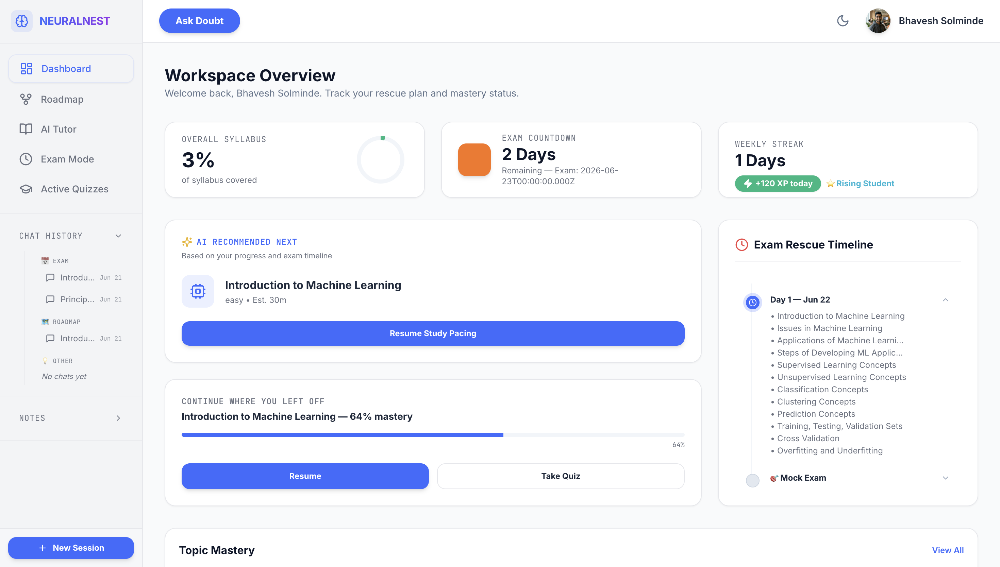

  

  <h1>🧠 NeuralNest AI</h1>
  
<strong>Your Ultimate AI-Powered Academic Companion</strong>

  
  
  

---

## 🏆 Why NeuralNest? (The Finalist's Edge)

We didn't just build a wrapper around an LLM. We built a complete, agentic **Learning Operating System** (NeuralNest OS). Designed to end blind cramming, NeuralNest fundamentally transforms how students master complex subjects by combining graph-based progression, gamified active recall, adaptive exam rescue plans, and a highly stateful LangGraph-powered AI tutor. 

Every pixel, from our glassmorphic dark mode to our interactive comprehension chips, has been obsessively crafted for student focus and engagement.

**Experience the future of education here:** 👉 [Live Application (Vercel)](https://ai-tutor-ebon-tau.vercel.app/)

---

## 🔥 Flagship Features

### 1. 🤖 LangGraph-Powered Agentic Tutor
NeuralNest's AI is backed by an advanced multi-node LangGraph architecture. It doesn't just answer questions; it drives the curriculum.
- **Context-Aware Memory**: Remembers your mastery level, current topic, and past mistakes across sessions.
- **Q&A Doubt Mode**: Interrupt the tutor mid-lesson with a burning question. The AI will gracefully pause the curriculum, answer your specific doubt, and then seamlessly resume teaching where it left off.
- **Interactive Comprehension Chips**: Real-time feedback buttons (👍 Understood, 🤔 Need more help, 🚀 Go deeper) that dynamically alter the AI's next instructional node.
- **Integrated Web Search**: With a single toggle, the tutor agents can query the web (via Tavily) to pull in the latest documentation or current events.
- **Dynamic YouTube Injection**: The AI intelligently recommends highly relevant YouTube video tutorials inline within the chat when explaining complex concepts.

### 2. 🗺️ Visual Syllabus Roadmap (React Flow)
Learning isn't linear, it's a web. We visualize the entire syllabus using a stunning, interactive graph built on React Flow.
- **Node-Based Progression**: Topics are locked until prerequisites are mastered.
- **Real-Time Mastery Tracking**: Each node displays estimated completion time, difficulty level, and your current mastery percentage.
- **Animated Edge Gradients**: Beautiful UI that visually guides the student from fundamental topics to advanced concepts.

### 3. 🚨 Exam Rescue Plan & PYQ Intelligence
Your exam isn't going to study for itself. NeuralNest generates a day-by-day rescue timeline up to your exact exam date.
- **Adaptive Scheduling**: Dynamically shifts topics based on the days remaining and your current mastery speed.
- **PYQ (Past Year Question) Calibration**: Upload past exam papers. Our RAG pipeline ingests them, analyzes testing patterns, and forces the tutor to prioritize highly-tested topics.
- **Mock Exam Integration**: Automatically schedules full mock exams in the timeline just before test day.

### 4. 🎮 Gamified Active Recall Quizzes
Reading isn't learning. We built an entire active recall engine to test knowledge dynamically.
- **AI-Generated MCQs**: Quizzes are generated on the fly based on the specific syllabus constraints of the current topic.
- **Hearts & Timers**: A high-stakes, gamified environment with countdown timers and a lives (hearts) system.
- **XP & Leveling**: Earn XP for correct answers, trigger floating UI animations, and climb the ranks from "Beginner" to "Master".
- **Intelligent Score Summary**: Immediate post-quiz feedback that mathematically updates your global Mastery Score and highlights specific weaknesses.

### 5. 📚 Multi-Modal RAG Document Intelligence
We allow students to bring their own context.
- **Upload Anything**: Supports PDFs, DOCX, and images.
- **Advanced Vector Search**: Documents are chunked and embedded via Cohere (`embed-english-v3.0`), stored in Pinecone, and seamlessly injected into the tutor's reasoning context.
- **Syllabus Grounding**: Prevents AI hallucinations by strictly anchoring the tutor's knowledge to the student's actual university syllabus.

### 6. ✨ World-Class UI/UX Design
We believe educational tools shouldn't look like legacy software from 2005.
- **Glassmorphic Aesthetics**: Beautiful background blurs, gradients, and soft shadows.
- **Meticulous Typography & Iconography**: Set in the clean `Inter` sans-serif font, heavily utilizing Lucide icons for a premium, native-app feel.
- **Micro-Interactions**: From pulsing notification dots to bouncing "Tutor is teaching..." typing indicators.

---

## 🏗️ The Engineering Under the Hood

To deliver this experience, we engineered a highly scalable, robust architecture:

- **Frontend**: React 18, React Router v7, Zustand (State Management), Tailwind CSS, React Flow, React Markdown.
- **Backend**: Node.js, Express, TypeScript, Mongoose (MongoDB).
- **AI & Graph Logic**: LangGraph, LangChain, OpenAI (`gpt-4o`).
- **Embeddings & Vector DB**: Cohere, Pinecone.
- **Authentication & Storage**: Passport.js (Google/GitHub OAuth), Cloudinary.
- **Observability**: LangSmith integrated for full trace debugging of our agentic workflows.

---

## 📸 See It In Action

*(Judges: Please visit the live link to experience the app, or view the screenshots below)*

> **Live Demo:** [ai-tutor-ebon-tau.vercel.app](https://ai-tutor-ebon-tau.vercel.app/)

  
  

---

  Built with ❤️ for the future of education.

