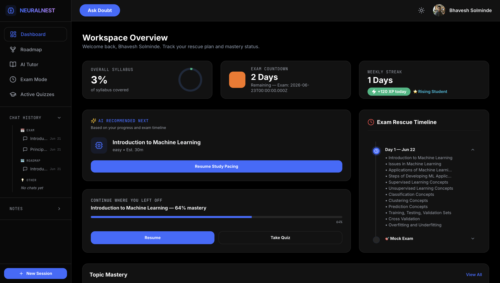

<div align="center">



<br/><br/>

# NeuralNest
### An adaptive learning platform powered by agentic graphs.

[](https://ai-tutor-ebon-tau.vercel.app/)
[](https://ai-tutor-production-2957.up.railway.app/)
[](#)

</div>

---

NeuralNest is a fully agentic LangGraph system that verifies student understanding after every explanation, re-teaches when confused, and autonomously manages an entire curriculum from syllabus to exam day.

---

## Capabilities

| Feature | Category |
|---------|----------|
| [Multi-Step Agentic Teaching Loop](#multi-step-agentic-teaching-loop) | AI Core |
| [Real-Time Comprehension Grading](#real-time-comprehension-grading) | AI Core |
| [Tool-Calling ReAct Tutor](#tool-calling-react-tutor) | AI Core |
| [Agentic Doubt Routing](#agentic-doubt-routing) | AI Core |
| [Topic Extraction Pipeline](#topic-extraction-pipeline) | AI Pipeline |
| [PYQ Frequency Analyzer](#pyq-frequency-analyzer) | AI Pipeline |
| [YouTube Context Retrieval](#youtube-context-retrieval) | AI Pipeline |
| [Persistent Learning Profile](#persistent-learning-profile) | AI Core |
| [Interactive Visual Roadmap](#interactive-visual-roadmap) | Learning |
| [Automated Study Scheduler](#automated-study-scheduler) | Learning |
| [Gamified Assessment Engine](#gamified-assessment-engine) | Quizzes |
| [Mastery Scoring System](#mastery-scoring-system) | Progress |
| [Multi-Modal Ingestion](#multi-modal-ingestion) | Onboarding |
| [Progress Dashboard](#progress-dashboard) | Dashboard |
| [Multi-Namespace RAG](#multi-namespace-rag) | Infrastructure |
| [Dual-Theme Interface](#dual-theme-interface) | UI |
| [LangSmith Tracing](#langsmith-tracing) | DevOps |

---

## Multi-Step Agentic Teaching Loop

The teaching backend is a stateful LangGraph graph that cycles through specialist nodes until understanding is verified.

```text
__start__ → router ──┬── tutorNode → gradeNode ──┬── UNDERSTOOD → END
                     │                            ├── CONFUSED   → tutorNode (simpler)
                     │                            ├── PARTIAL    → tutorNode (deeper)
                     │                            └── DOUBT      → doubtNode → END
                     ├── doubtNode → END
                     └── quizGeneratorNode → END
```

## Real-Time Comprehension Grading

After every explanation, the AI poses a checkpoint question. The `gradeNode` (GPT-4o) classifies the response using structured output:

- **Understood:** Moves to the next topic.
- **Confused:** Re-routes to `tutorNode` in simpler analogy mode.
- **Partial:** Re-routes to `tutorNode` for step-by-step breakdown.
- **Doubt:** Re-routes to `doubtNode` for targeted Q&A.

The system does not advance the curriculum until it verifies understanding.

## Tool-Calling ReAct Tutor

The `tutorNode` runs a ReAct loop where GPT-4o autonomously decides when to search:

- **Search uploaded materials:** Queries Pinecone vector store across multiple namespaces (student's uploaded PDFs, session notes).
- **Search web:** Uses Tavily for real-world analogies or current documentation.

## Agentic Doubt Routing

Students can interrupt the teaching flow via Doubt Mode. The `routerNode` routes to `doubtNode`, answers the specific question, and returns the student to the curriculum flow without losing state.

## Topic Extraction Pipeline

When a syllabus or notes are provided, a structured extraction pipeline analyzes the content and produces 30–60 granular topic nodes. Each node carries a difficulty rating, estimated time, and prerequisite edges, forming a directed acyclic graph.

## PYQ Frequency Analyzer

In Exam Mode, uploaded past year papers are parsed and classified. The pipeline counts topic frequency across all papers and uses this data to prioritize high-yield topics in the generated study plan.

## YouTube Context Retrieval

The tutor searches the YouTube Data API for relevant educational videos after each explanation, rendering them inline to support visual learners.

## Persistent Learning Profile

The `gradeNode` writes back to the user's `learningProfile` in MongoDB, tracking struggled concepts and preferred explanation styles. The `tutorNode` reads this profile on every session to calibrate its approach.

## Interactive Visual Roadmap

The full syllabus is visualized as a directed graph built on React Flow. Nodes reflect real-time mastery states (locked, learning, mastered), and edges enforce prerequisite dependencies.

## Automated Study Scheduler

When an exam date is set, the system calculates available days, sorts topics by yield and mastery, and generates a day-by-day plan with automatic mock exams. The plan recalibrates if quiz scores drop below threshold.

## Gamified Assessment Engine

Topics conclude with an AI-generated 10-question adaptive quiz. The engine features a countdown timer, a 5-lives system, and XP rewards. Pass threshold is 70%.

## Mastery Scoring System

Mastery is computed from a weighted formula without LLM overhead:

```text
masteryScore = round( (quizScore × 0.6) + (selfRating × 0.3) + (engagement × 0.1) ) × 100
```

## Multi-Modal Ingestion

The ingestion pipeline handles PDFs, DOCX, and images (via GPT-4o Vision OCR). Files are chunked, embedded via Cohere `embed-english-v3.0`, and upserted to user-isolated Pinecone namespaces.

## Multi-Namespace RAG

Retrieval operates across three tiers:
- Single session namespace.
- Multi-session retrieval from selected materials.
- Global fallback across the entire user knowledge base.

## Dual-Theme Interface

The interface uses a strict design token system with two modes. The application adheres to functional UI patterns with consistent state indicators, typography scaling, and reduced-motion fallbacks.

## LangSmith Tracing

Every LangGraph run is traced end-to-end. Node-level traces, tool calls, token counts, and latency are logged for observability, supplemented by Pino-based structured logging for server events.

---

## Tech Stack

**Frontend:** React 18, React Router v7, Tailwind CSS, Zustand, React Flow
**Backend:** Node.js, Express, TypeScript
**AI:** LangGraph, LangChain, GPT-4o, Cohere (Embeddings), Pinecone (Vector DB), Tavily (Search)
**Data:** MongoDB Atlas, Cloudinary
**Auth:** Passport.js (Google OAuth, GitHub OAuth, Local), JWT
**Observability:** LangSmith, Pino
**Deployment:** Vercel (Frontend), Railway (Backend)

---

## Data Models

- **User:** Tracks XP, streaks, study days, and learning profile.
- **Session:** Maps user input to Pinecone namespaces.
- **Topic:** Tracks mastery score, frequency, and prerequisite relationships.
- **ChatHistory:** Categorizes conversations by context (Exam, Roadmap, Open).
- **QuizResult:** Records attempt scores, mastery deltas, and time taken.
- **StudyPlan:** Maintains the daily assigned topic schedule.
- **Exam:** Manages target dates and associated syllabus materials.
